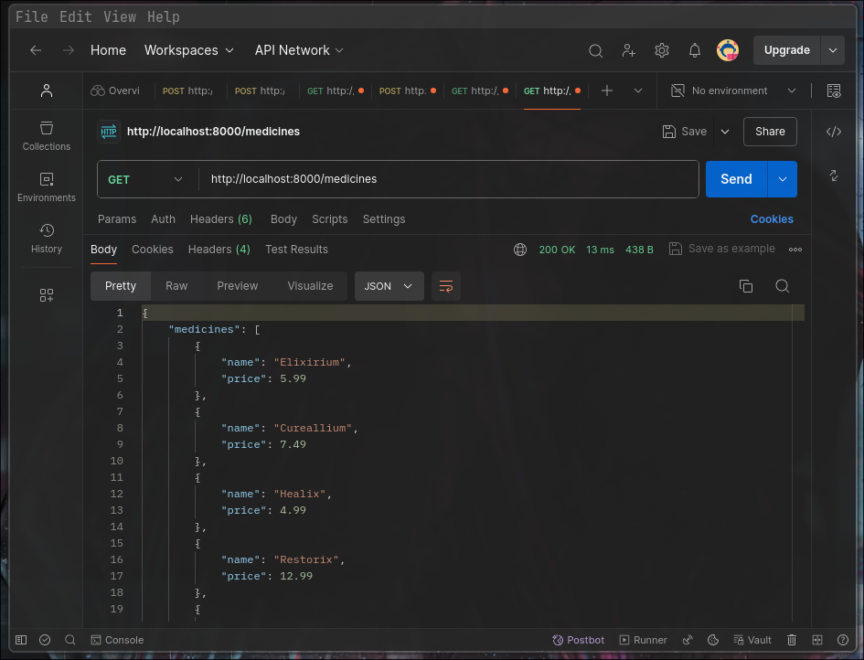
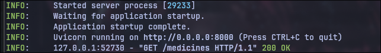
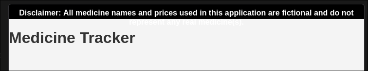
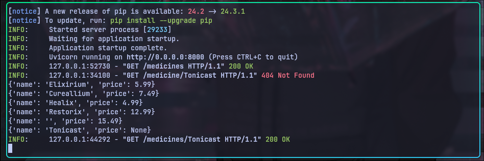
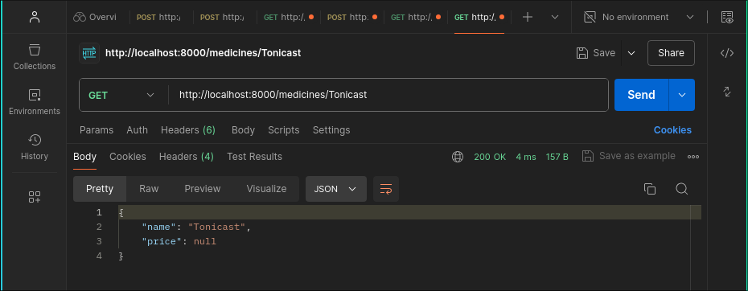
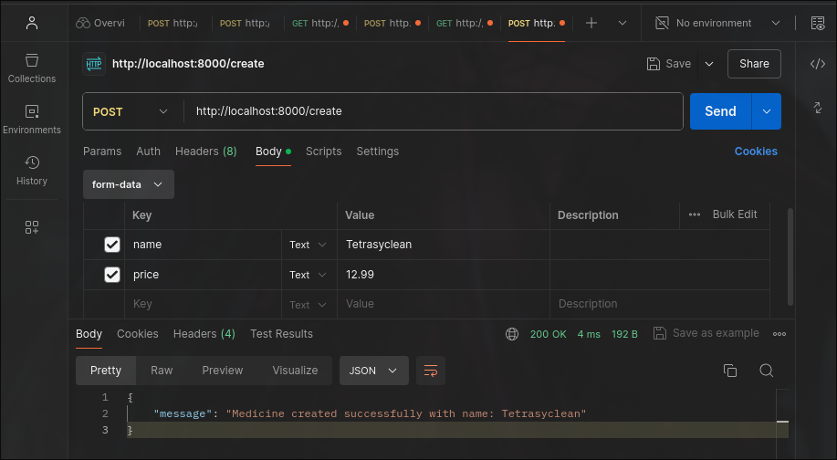
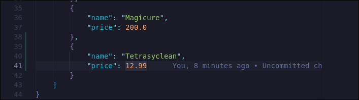
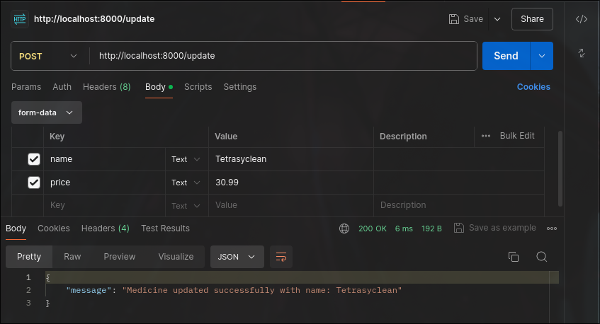
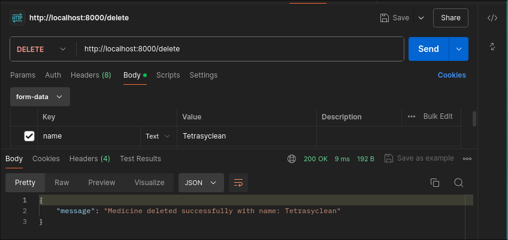
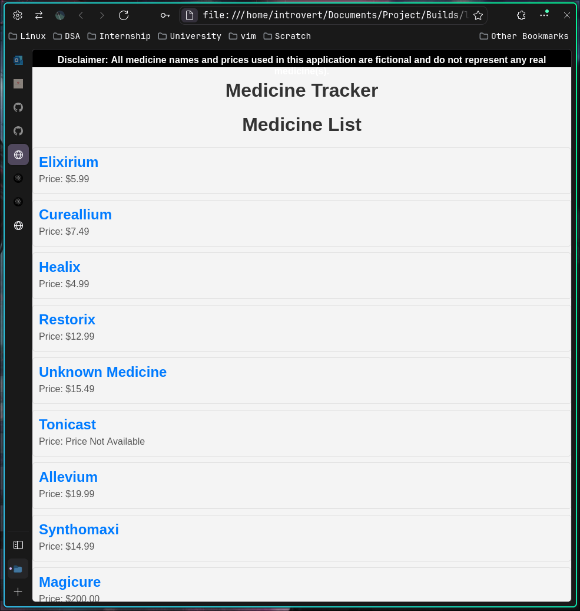

## Disclaimer

> **Note:**  
> This document is a work in progress and serves as a brain dump for ideas and notes until the project is completed.  
> Please treat this as an informal reference during development.

In other to run the start.sh script on my linux, i had to first chmod the script usig the command: 
```sh
chmod +x start.sh
```
Then i run the script running the:
```sh
start.sh
```
Upon running the command, the initialisation of the script started , below is a screenshot.
---
Now that the backend is running what we are goihg to do, it try to test the endpoint uusing postman. 
Todo: Make sure to add what postman is and why it's been used.
To confirm the server is running you should see something like this on your console or terminal
```
INFO:     Started server process [29233]
INFO:     Waiting for application startup.
INFO:     Application startup complete.
INFO:     Uvicorn running on http://0.0.0.0:8000 (Press CTRL+C to quit)
```
So before I proceed to running postman, i need to check the `main.py` class and go throught he method endpoints once again to understand how the endpoints work.
Upon looking at the `main.py` i realised presently in the `endpoints`.
1. `/medicine` endpoints - for getting all the medicine 
2. `/medicine/{name}` - for getting a single medicine by the name
3. `/create` - for creating new medicine
4. `/update` - for updating for updating the neccessary fileds of the medicines
5. `/delete` for deleting any medicines

### Endpoints Todo

- [ ] Tests get all medicine
In other to test the `/medicine` endpoints, i opened postman and select the get request and paste in the url for the endpoints which in return return a response with status 200 and a body containing medicine details in json format. 



-[ ] Run the frontend to confirm if its running
Open the index.html file in my browser which display a UI containing a header (Medicine Tracker).

What am going to do next is test the other enpoints to see which is working well and which have error.
- [ ] Test the `/medicine{name}` 
This endpoint successful return a response body and status code 200 ok, the response body contains the neccessary requested medicine with the name `Tonicast`.


I also try to get one more medicine `Cureallium` to further test the endpoints.
- [ ] Test the endpoints for `/create`
In other to test this endpoint using postman, i create a new post request in postman, passing in the new medicine name() and price in the form-data after a responsebody was return with a message and status code 200 ok.
```http
{
    "message": "Medicine created successfully with name: Tetrasyclean"
}
```

New medicine was updated in the database

- [ ] Test the `/update` 
Created a new POST request, to update the price of the medicine, this endpoint doesnt update the name becuase the name is used as a unique identifier for the medicine. 
SO we pass in the name as parm to the form-data and then the price to vbe updated.
So i am just going to use the same name for the medicine i created `Tetrasyclean` and update the price from `12.99` to `30.99` since it's very expensive!!...hand its mine!!!.


The image above shows the successsful update of the medicine and the response message and status code 200 ok.
- [ ] Lastely test the `/delete` enpoints
For the delete endpoint, i sent a DELETE request and theen got a response message and a status code OK.. Meaning request was sent and executed corretly.


## Notices isssues
The issue i notice when `DELETE` and `UPDATE` the medicine request, this didnt update the medicine in the database `data.json` file, instead it just return a response message ok meaning the request was successsful but it didnt update the database itself.

TASK 1: Fetch data from the backend server and send it to the the frontend, displaying it in a user-friendly way.

First I added new Div to the `index.html` with the `id` medicines-list, this will contains all the of list of document retrieved from the API, the `id`. I fetch a list of medicine from the api endpoint
```js
document.addEventListener('DOMContentLoaded', () => {
    fetch('http://localhost:8000/medicines')
```
Then parse the json response from the server
```js
.then(response => {
        return response.json();
})
```
this helps to convert the raw response from the server into javascript object that can be worked with. In other to know and make sure that the data is being fetch i then log error that occurs during the fetch process.

```js
.catch(error => {
    console.error('Error fetching data:', error);
});
```
Finally added few css styling for the medicine list.

Future Plan is to dispplay the medicine list in form of a card element.